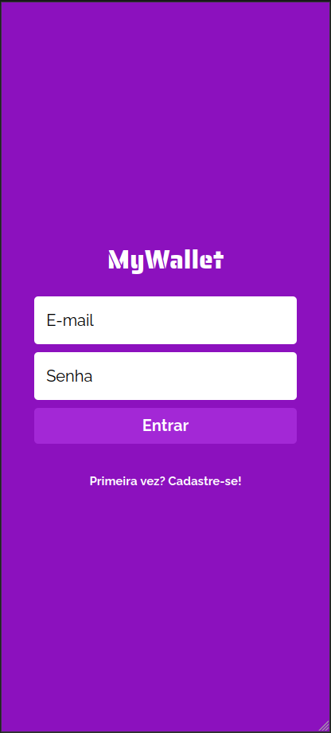
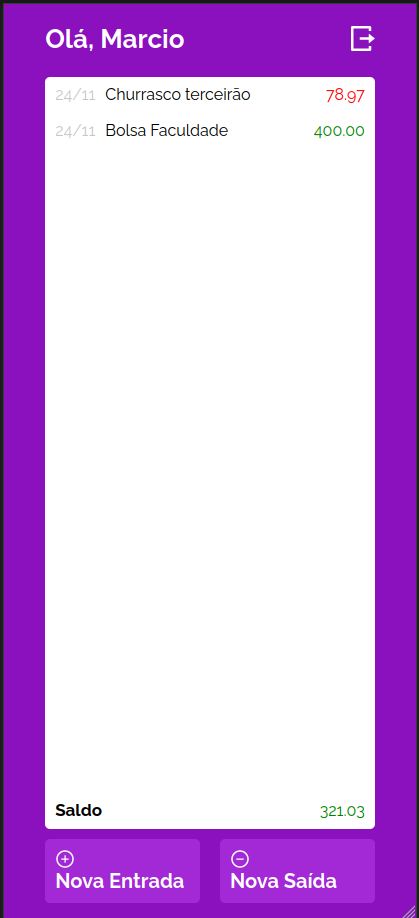

#My wallet

<h2>Intoduction</h2>

Welcome to My-Wallet-Front project, here I build an app to help you keep track of your money, it's a very simple one.

  
  

<h2>Here is a link to a deploy of my project in vercel:</h2>

https://my-wallet-front-ebon.vercel.app/

<h2>More in depth of the project</h2>

You have to sign-up as a user and then sign-in, after that, you will be redirected to a protected route, you can refresh the page and will still be logged in the sistem.
In the redirected page, you can then add transactions, adding money to your wallet or removing it (it's just numbers to help you with your finances, we don't actualy use money in this project), with that, the app will return your balance.

<h2>technologies I used:</h2>

<h2>How to run the project:</h2>

Clone the repo to your machine, then run the command 'npm i' to install all libraries.
Next, you will have to prepare the back-end for the app, you can find it here:

https://github.com/MarcioVCunha/MyWallet-Back

Just run 'npm start' and your page is up and running.
If you have the version 17.1.0, you can run 'npm run startnewnode' to fix the node error.